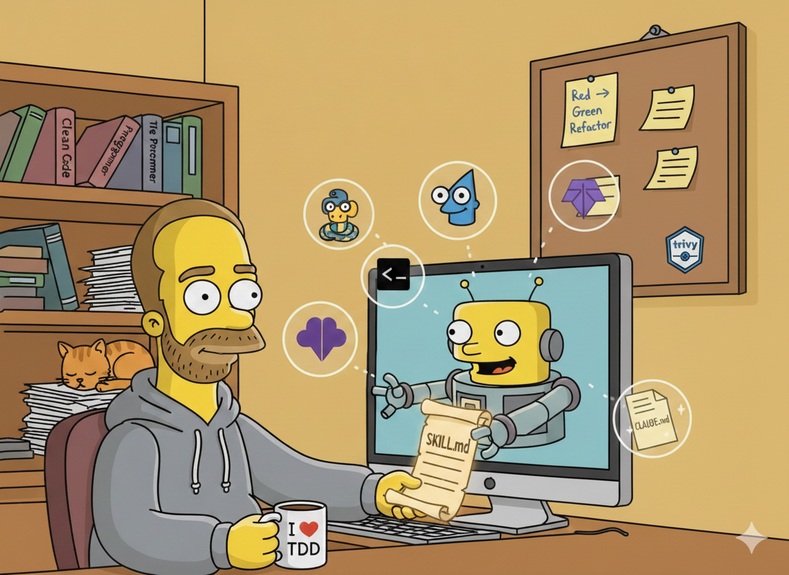

# Agent Toolkit

<p align="center">
  
</p>

A collection of production-quality skills, tools, and patterns for AI-powered development workflows with [Claude Code](https://claude.ai/code).

## Overview

Agent Toolkit provides a curated set of resources to enhance Claude Code's capabilities:

- **Skills**: Domain-specific knowledge modules that Claude loads on-demand
- **Patterns**: Cross-language architectural patterns and best practices
- **Workflows**: Integrated development workflows (TDD, security scanning, code review)

## Quick Start

### Installation

```bash
# Copy skills to Claude Code's skills directory
mkdir -p ~/.claude/skills
cp -r skills/* ~/.claude/skills/

# (Optional) Copy the example CLAUDE.md to customize your workflow
cp CLAUDE.md-example ~/.claude/CLAUDE.md
# Then edit ~/.claude/CLAUDE.md to personalize
```

### Verify Installation

```bash
# List installed skills
ls ~/.claude/skills/

# Test a skill (in Claude Code)
claude "/python"
```

## Repository Structure

```
agent-toolkit/
├── README.md                 # This file
├── LICENSE                   # MIT License
├── CLAUDE.md-example         # Example CLAUDE.md configuration
└── skills/                   # Claude Code skills
    ├── design-patterns/      # Cross-language architectural patterns (skill)
    ├── ast-grep/             # AST-aware code search patterns
    ├── bash/                 # Bash scripting skill
    ├── golang/               # Go development skill
    ├── python/               # Python development skill
    ├── make/                 # Makefile skill
    ├── terraform/            # Infrastructure as Code skill
    ├── scm/                  # Source control (Git) skill
    ├── trivy/                # Security scanning skill
    ├── gemini-review/        # Code review with Gemini
    ├── web-automation/       # Playwright E2E testing
    ├── skill-creator/        # Create new skills
    └── improve-skill/        # Improve existing skills
```

## Available Skills

### Language Skills

| Skill | Description | Triggers |
|-------|-------------|----------|
| **bash** | Production-quality bash scripts with ShellCheck compliance | `bash script`, `shell script`, `.sh` |
| **golang** | Go 1.26 idiomatic development with quality gates | `go code`, `golang`, `go patterns` |
| **python** | Modern Python 3.11+ with type hints and Pydantic | `pythonic`, `python patterns`, `.py` |
| **make** | Idiomatic Makefiles with safety and self-documentation | `makefile`, `make target`, `.mk` |
| **terraform** | Infrastructure as Code with Terraform/Terragrunt | `terraform`, `terragrunt`, `iac`, `.tf` |

### Workflow Skills

| Skill | Description | Triggers |
|-------|-------------|----------|
| **scm** | Git best practices, Conventional Commits, PR workflows | `git`, `commit`, `branching` |
| **trivy** | Security vulnerability scanning before commit | `trivy`, `vulnerability scan`, `security` |
| **gemini-review** | Design and code review with Gemini | `code review`, `gemini review` |
| **web-automation** | E2E testing and browser automation | `e2e test`, `playwright` |

### Architecture Skills

| Skill | Description | Triggers |
|-------|-------------|----------|
| **design-patterns** | Cross-language patterns (DI, errors, config, testing) | `dependency injection`, `anti-pattern`, `design pattern` |
| **ast-grep** | AST-aware code search and refactoring | `ast-grep`, `find function`, `structural search` |

### Meta Skills

| Skill | Description |
|-------|-------------|
| **skill-creator** | Create and validate new Claude Code skills |
| **improve-skill** | Analyze sessions to improve existing skills |

## CLAUDE.md Configuration

The `CLAUDE.md-example` file provides a starting point for configuring Claude Code's behavior. It includes:

- **Decision Framework**: Tiered autonomy (autonomous, collaborative, ask permission)
- **Code Philosophy**: TDD, KISS, YAGNI, Boy Scout Rule
- **File Standards**: ABOUTME headers, naming conventions
- **Workflow Integration**: Gemini review triggers, skill invocation rules

To use:

```bash
cp CLAUDE.md-example ~/.claude/CLAUDE.md
# Edit the file to customize for your workflow
```

## Skill Usage

Skills are invoked automatically when Claude Code detects relevant keywords:

```bash
# Automatic invocation (keyword detection)
claude "write a bash script to backup my files"

# Manual invocation
claude "/bash"
claude "/terraform"
```

## Integrated Workflows

### Secure Commit Workflow

The toolkit includes an integrated security scanning workflow:

```
git commit → Detect Changes → Trivy Scan → Remediation (if needed) → Commit
```

See `skills/scm/references/commit-workflow.md` for details.

### TDD Workflow

Skills enforce Test-Driven Development:

1. **Red**: Write failing test
2. **Green**: Minimal code to pass
3. **Refactor**: Clean up
4. **Commit**: After each phase

### Code Review Workflow

Automatic Gemini review triggers:

- More than 100 lines changed
- More than 3 files with logic changes
- Security or performance code

## Creating New Skills

Use the `skill-creator` skill:

```bash
# Initialize a new skill
uv run ~/.claude/skills/skill-creator/scripts/init_skill.py \
    my-new-skill \
    --path ~/.claude/skills

# Validate a skill
uv run ~/.claude/skills/skill-creator/scripts/validate_skill.py \
    ~/.claude/skills/my-new-skill
```

### Skill Structure

```
skill-name/
├── SKILL.md              # Main skill definition (required)
├── scripts/              # Executable helpers (optional)
├── references/           # Additional documentation (optional)
└── resources/            # Templates and assets (optional)
```

### SKILL.md Format

```yaml
---
name: skill-name
description: >-
  What the skill does. Triggers on "keyword1", "keyword2".
allowed-tools: Read, Write, Edit, Bash
---

# ABOUTME: Brief description of file purpose
# ABOUTME: Key context or dependencies

# Skill Title

[Skill content...]
```

## Design Principles

- **Production-Ready**: Skills enforce patterns that work in real codebases
- **Opinionated**: Best practices are baked in, not optional
- **Integrated**: Skills work together (security + commit + review)
- **Progressive Disclosure**: Core info in SKILL.md; details in references

## Contributing

Contributions welcome! Please ensure:

1. Skills follow the established structure
2. ABOUTME headers present on all files
3. Trigger phrases included in descriptions
4. Code passes validation: `validate_skill.py`

## Acknowledgements

This project is inspired by and builds upon the work of [Massimo Aroffo](https://github.com/maroffo) and the [claude-forge](https://github.com/maroffo/claude-forge) repository. Many of the architectural patterns and skill design principles originated from that project.

## License

MIT License - see [LICENSE](LICENSE) for details.

Use, fork, and modify freely; attribution required (keep the copyright notice).

## Resources

- [Claude Code Documentation](https://claude.ai/code)
- [Anthropic Documentation](https://docs.anthropic.com/)
